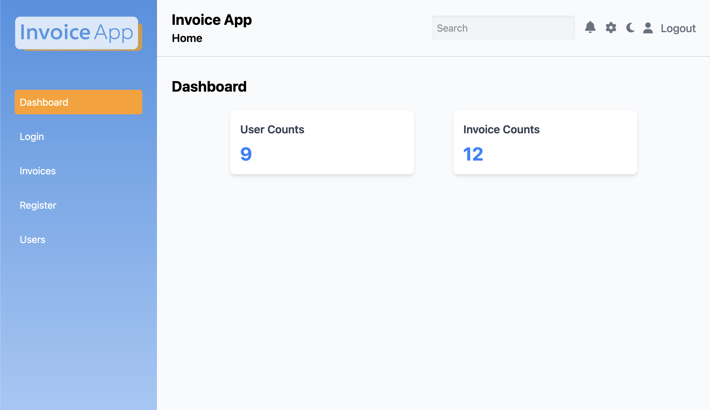
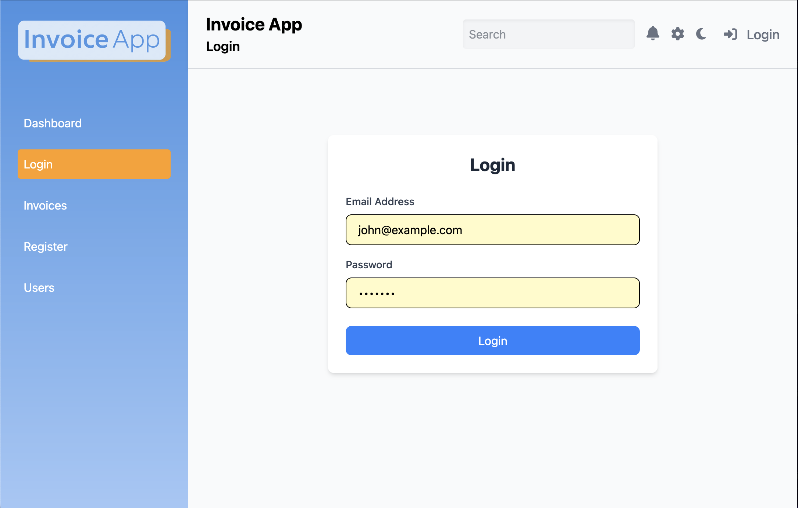

# Root Setup Instructions

This repository contains both the server-side and client-side applications for the project. Follow the instructions below to set up and run the entire project.

## Project Overview

### Server-Side
The server is built using **Node.js** and **NestJS** and provides a RESTful API for user and invoice management. It uses **PostgreSQL** as the database, managed via **Prisma ORM**, and features JWT-based authentication. The server includes Docker support for easy deployment.

For detailed server setup instructions, refer to the [server readme](./server/README.md).

### Client-Side
The client is built using **ReactJS** with **TypeScript**, powered by **Vite** for fast development. It features 
**TailwindCSS** for styling, **Redux Toolkit** for state management, and **TanStack Table** for table 
functionalities. 

For detailed client setup instructions, refer to the [client readme](./client/readme.md).


## Root Setup Instructions

1. Clone the repository.
2. Follow the server setup instructions in `server/README.md`.
3. Follow the client setup instructions in `client/readme.md`.
4. Ensure both the server and client are running.

## User Login
Email: john@example.com
Password: 1234567

## Project Structure
```plaintext
root/
├── client/               # Client-side application
├── server/               # Server-side application
├── docker-compose.yml    # Docker setup for the database
└── README.md             # This file
```

## Screenshots

1. **Home Page**
   

1. **Login Page**
   

1. **Invoices Page**
   

1. **Invoice Details Modal**
   

1. **Register Page**
   

1. **Users Page**
   


